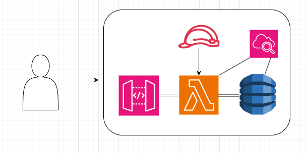

# Build a REST API with AWS Lambda, API Gateway, and DynamoDB

This guide will walk you through setting up a REST API using AWS Lambda, API Gateway, and DynamoDB, with logging managed through Amazon CloudWatch. The API will support CRUD operations (Create, Read, Update, Delete) on inventory items.

## Architecture Diagram

## Prerequisites
- AWS account with appropriate permissions to create and manage Lambda, API Gateway, DynamoDB, and CloudWatch resources.
- Basic knowledge of Python programming.

## Step 2: Create a DynamoDB Table

### 2.1 Open DynamoDB Service
- Log in to the AWS Management Console and navigate to the DynamoDB service.

### 2.2 Create a New Table
- Click on "Create table".
- Enter a `Table name` (e.g., `inventory_info`) and a `Primary key` (e.g., `inventoryId` of type String).
- Use the default settings for the rest and click "Create".

## Step 3: Create an IAM Role for Lambda Function

### 3.1 Navigate to IAM Service
- Open the IAM service in the AWS Console.

### 3.2 Create a New Role
- Select "Roles" from the sidebar and click "Create role".
- Choose "AWS service" as the type of trusted entity, and select "Lambda" as the service that will use this role.
- Attach policies like `AmazonDynamoDBFullAccess`, `AWSLambdaBasicExecutionRole`, and `CloudWatchFullAccess`.
- Name the role and create it.

## Step 4: Create a Lambda Function for CRUD Operations

### 4.1 Open Lambda Service
- Go to the Lambda service in the AWS Console.

### 4.2 Create a New Lambda Function
- Click "Create function".
- Choose "Author from scratch".
- Enter a function name.
- Select Python 3.x as the runtime.
- Choose the IAM role created in Step 3.
- Click "Create function".

### 4.3 Add the Python Code
- In the function code editor, paste the Python code provided for handling various HTTP methods and paths to provide CRUD functionalities on inventory items.

## Step 5: Set Up API Gateway

### 5.1 Navigate to API Gateway Service
- Open API Gateway in the AWS Console.

### 5.2 Create a New API
- Choose "REST API" and click "Build".
- Select "New API" and fill in the API name.
- Click "Create API".

### 5.3 Define Resources and Methods

#### Status Check
- **Resource**: `/status`
  - **GET**: Used to check the operational status of the API. This method should be integrated with a Lambda function that returns a simple message indicating that the service is operational.

#### Inventory Resource
- **Resource**: `/inventory`
  - **GET**: Retrieves a specific inventory item by ID. Ensure this is integrated with the appropriate Lambda function that handles GET requests for an individual item.
  - **POST**: Adds a new inventory item. Link this method to the Lambda function that processes POST requests to create new items.
  - **PATCH**: Updates an existing inventory item. This should be connected to the Lambda function that handles modifications to items.
  - **DELETE**: Deletes an inventory item by ID. Integrate this with the Lambda function designed to handle DELETE requests.

#### Inventories Resource
- **Resource**: `/inventories`
  - **GET**: Retrieves all inventory items. This should be linked to the Lambda function that handles fetching multiple inventory records at once.

#### Inventory Search
- **Resource**: `/inventory/search`
  - **GET**: Provides search functionality to find inventory items based on various criteria like name or category. Make sure this method is integrated with a Lambda function that can handle query parameters and return filtered results.

#### Inventory History
- **Resource**: `/inventory/history`
  - **GET**: Retrieves the history of changes made to a specific inventory item. This should connect to a Lambda function that can pull historical data for an item.

#### Bulk Operations
- **Resource**: `/inventory/bulk`
  - **POST**: Allows the bulk insertion or update of multiple inventory items at once. Link this to a Lambda function designed to handle batch processing of inventory data.

### Resource Integration
For each resource and method:
- Go to the Amazon API Gateway console.
- Select your API and navigate to the Resources panel.
- Choose the resource or create a new one by clicking "Create Resource".
- Add methods by selecting the resource, clicking "Create Method", and then selecting the appropriate HTTP method.
- Configure each method to integrate with the corresponding AWS Lambda function:
  - Choose "Lambda Function" for the integration type.
  - Enter the name of the Lambda function that should handle the request.
  - Ensure the correct deployment stage and region are selected.
  - Save and deploy the changes to make them effective.

### Deployment
- After setting up all resources and methods, make sure to deploy your API:
  - Navigate to "Stages" in the API Gateway console.
  - Select your stage or create a new one.
  - Click on "Deploy API" to update the stage with the latest changes.

This expanded setup ensures that your API Gateway is fully equipped to handle a variety of operations essential for managing inventory as well as providing operational status feedback.

## Step 6: Enable Logging with CloudWatch

### 6.1 Modify the API Gateway Settings
- In API Gateway, go to "Stages".
- Select the stage you want to enable logging for.
- Under the "Logs/Tracing" tab, enable CloudWatch logging.

### 6.2 View Logs in CloudWatch
- Navigate to the CloudWatch service to view the logs generated by API requests.
